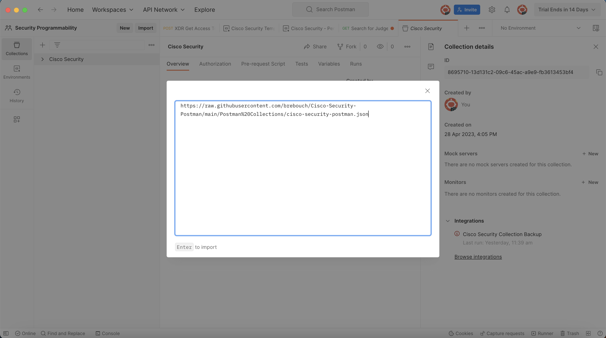

# Cisco-Security-Postman

This project is intended to be a single collection of all Cisco Security 
API resources.

## Importing Collection & Environment

### Collection

From your workspace, click the import button and paste in the following
URL:\n
https://raw.githubusercontent.com/brebouch/Cisco-Security-Postman/main/Postman%20Collections/cisco-security-postman.json

### Environment

Follow the same process described above with the following URL:\n
https://raw.githubusercontent.com/brebouch/Cisco-Security-Postman/main/Postman%20Environment/Cisco%20Security%20Environment.json

## Documentation Structure

The repository is organized as a single Postman collection. Within 
the repository, each directory is product specific and includes the 
README file describing how to use the collection.